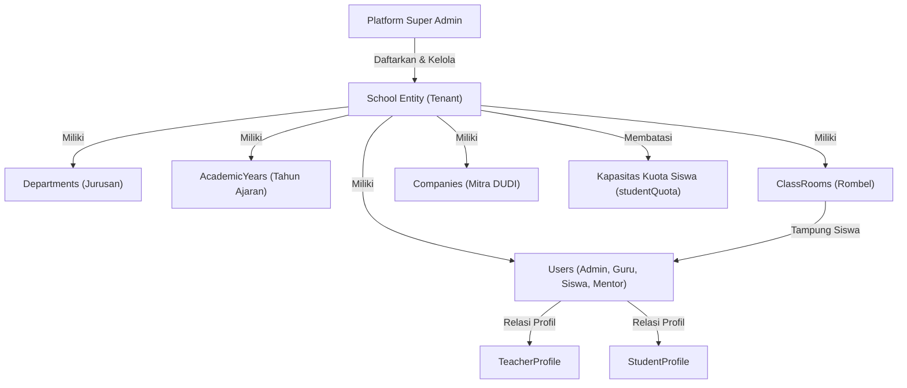

# Arsitektur & Desain Sistem

Dokumen ini menguraikan arsitektur teknis, desain multi-tenant, model data database, sistem otentikasi, serta pembagian modul pada SaaS Sistem Informasi Sekolah.

---

## 1. Stack Teknologi & Fondasi

Aplikasi ini dibangun menggunakan arsitektur full-stack terintegrasi:

| Lapisan | Teknologi | Penjelasan |
| :--- | :--- | :--- |
| **Framework Full-Stack** | [Wasp](https://wasp.sh) (`v0.25.0`) | Framework terkompilasi deklaratif yang menyatukan React, Node.js, routing, otentikasi, RPC queries/actions, dan Prisma ke dalam satu sistem terpadu. |
| **Frontend UI** | React 18 + TypeScript | Komponen antarmuka modern berbasis Google Material 3 (Material You) dan Tailwind CSS. |
| **Backend Server** | Node.js + Express (Wasp Server) | Server API type-safe dengan enkapsulasi operasi RPC (Queries & Actions). |
| **Database & ORM** | PostgreSQL + Prisma ORM | Manajemen skema database relasional, migrasi otomatis, dan *type-safe database client*. |
| **Desain Sistem** | Google Material 3 (M3) | Skema warna dinamis, hierarki tipografi standar Roboto, serta bentuk Expressive. |
| **Validasi Data** | Zod (`zod`) | Validasi skema input runtime ketat pada setiap RPC action & query. |
| **Font & Ikon** | Google Material Symbols Rounded | 100% ikonografi standar Material Symbols tanpa dependensi ikon heterogen. |

---

## 2. Arsitektur Multi-Tenancy

Platform ini dirancang khusus untuk melayani banyak sekolah (*multi-tenant*) dalam satu basis kode dan basis data bersama (*shared database, schema-based isolation*):



### Isolasi Tenant Berbasis `schoolId`
1. Setiap entitas sekolah (`School`) memiliki pengenal unik (`id` UUID) dan `slug`.
2. Setiap pengguna (`User`), rombel (`ClassRoom`), jurusan (`Department`), tahun ajaran (`AcademicYear`), perusahaan mitra (`Company`), dan mata pelajaran (`LmsCourse`) terikat langsung pada `schoolId`.
3. Pada tingkat server, setiap operasi CRUD dilindungi oleh fungsi pengaman (*auth guard*) `ensureSchoolUser(context)` atau `requireSchoolAdmin(context)` yang memastikan pengguna hanya dapat membaca dan memanipulasi data milik unit sekolah mereka sendiri.

### Mekanisme Multi-Tenant Super Admin
Pengguna dengan peran `SUPERADMIN` (atau flag `isAdmin: true`) memiliki kemampuan istimewa:
- Melihat seluruh sekolah terdaftar di platform melalui `/school/admin/schools` (`getAllSchools`).
- Berpindah tenant aktif (*tenant switcher*) melalui action `switchActiveSchool({ targetSchoolId })` untuk melakukan supervisi atau pemecahan masalah sekolah tertentu.

---

## 3. Sistem Peran Pengguna (*User Roles*) & Auth Guards

Hierarki peran didefinisikan melalui enum Prisma `UserRole`:

```prisma
enum UserRole {
  SUPERADMIN
  SCHOOL_ADMIN
  TEACHER
  STUDENT
  DUDI_MENTOR
}
```

### Auth Guards (`app/src/school/authGuards.ts`)

| Fungsi Pengaman | Peran yang Diizinkan | Kegunaan |
| :--- | :--- | :--- |
| `ensureAuthenticated` | Semua pengguna login | Memastikan sesi pengguna valid. |
| `ensureSuperAdmin` | `SUPERADMIN` / `isAdmin` | Operasi lintas sekolah & konfigurasi platform global. |
| `ensureSchoolUser` | Sesuai parameter peran | Memastikan akun terhubung ke `schoolId` unit sekolah yang valid. |
| `requireSchoolAdmin` | `SCHOOL_ADMIN`, `SUPERADMIN` | Manajemen master data, kurikulum, kepegawaian, kesiswaan, dan pengaturan sekolah. |
| `requireTeacher` | `TEACHER`, `SCHOOL_ADMIN`, `SUPERADMIN` | Pengisian agenda KBM, presensi kelas, evaluasi nilai, dan bimbingan PKL. |
| `requireStudent` | `STUDENT`, `SUPERADMIN` | Akses materi LMS, pengumpulan tugas, presensi harian, dan logbook PKL. |
| `requireDudiMentor` | `DUDI_MENTOR`, `SUPERADMIN` | Verifikasi jurnal PKL dan evaluasi performa kerja siswa di mitra industri. |

---

## 4. Struktur Spesifikasi Wasp (`*.wasp.ts`)

Alih-alih menggunakan satu file konfigurasi raksasa, arsitektur konfigurasi Wasp dipecah menjadi file spesifikasi modular yang bersih:

```
app/
├── main.wasp.ts              # Entrypoint konfigurasi Wasp utama
├── src/
│   ├── auth/auth.wasp.ts     # Konfigurasi autentikasi email & password
│   ├── user/user.wasp.ts     # Rute & operasi profil pengguna umum
│   ├── school/
│   │   ├── school.wasp.ts    # Spesifikasi modul inti sekolah & master data
│   │   └── operations.ts     # Implementasi query & action master data sekolah
│   ├── pkl/
│   │   ├── pkl.wasp.ts       # Spesifikasi modul E-PKL Terpadu
│   │   └── operations.ts     # Implementasi query & action PKL & monitoring EWS
│   ├── lms/
│   │   ├── lms.wasp.ts       # Spesifikasi modul LMS Kurikulum Merdeka
│   │   └── operations.ts     # Implementasi KBM, materi, tugas, CBT
│   ├── governance/
│   │   ├── governance.wasp.ts# Spesifikasi modul Tata Kelola & Supervisi
│   │   └── operations.ts     # Implementasi Guru Piket, Wali Kelas, Waka Kurikulum
│   └── reports/
│       ├── reports.wasp.ts   # Spesifikasi modul Laporan & Cetak KOP Surat
│       └── operations.ts     # Implementasi agregasi data cetak dokumen kedinasan
```

---

## 5. Model Data Inti (Prisma Schema Highlights)

### 1. Entitas Sekolah & Profil Pengguna
- **`School`**: Data institusi (nama, slug, NPSN, jenjang `level` [SD, SMP, SMA_SMK], KOP surat, kuota siswa `studentQuota`, status langganan).
- **`User`**: Akun login (email, username, peran, `schoolId`, `classRoomId`).
- **`TeacherProfile`**: Profil guru (NIP, gelar akademik, telepon/WA, status `isWaka`).
- **`StudentProfile`**: Profil siswa (NIS, NISN, jenis kelamin L/P, tanggal lahir, status keaktifan `ACTIVE`, `SUSPENDED`, `GRADUATED`).

### 2. Master Data Akademik
- **`AcademicYear`**: Periode tahun ajaran (misal: "2026/2027", semester "GANJIL" / "GENAP", flag `isActive`).
- **`Department`**: Program/kompetensi keahlian jurusan (misal: "RPL", "TKJ", "IPA", "IPS").
- **`ClassRoom`**: Rombel kelas (tingkat `gradeLevel`, nama "X RPL 1", wali kelas `homeroomTeacherId`).

### 3. Modul Pembelajaran LMS
- **`LmsCourse`**: Mata pelajaran kelas (judul `subjectName`, pengampu `teacherId`, rombel `classRoomId`).
- **`LmsMaterial`**: Modul/materi bacaan & tautan referensi.
- **`LmsAssignment` & `LmsSubmission`**: Penugasan siswa dengan tenggat waktu dan penilaian nilai/feedback.
- **`LmsAttendanceSession` & `LmsAttendanceRecord`**: Presensi KBM mata pelajaran (Hadir, Sakit, Izin, Alpa).
- **`LmsAssessment`**: Bank soal dan ujian daring CBT (Pilihan Ganda & Esai).

### 4. Modul E-PKL
- **`Company`**: Direktori mitra industri (nama, kuota tampung, titik koordinat latitude/longitude, radius presensi).
- **`Placement`**: Surat penempatan siswa di DUDI dengan guru pembimbing dan instruktur industri.
- **`AttendanceLog`**: Presensi masuk/pulang siswa dengan validasi radius lokasi GPS.
- **`DailyJournal`**: Catatan logbook aktivitas harian siswa dan status verifikasi pembimbing.

### 5. Tata Kelola Kedinasan
- **`DutyTeacherReport`**: Laporan harian guru piket (rekap siswa terlambat, izin keluar/dispensasi, ketertiban).
